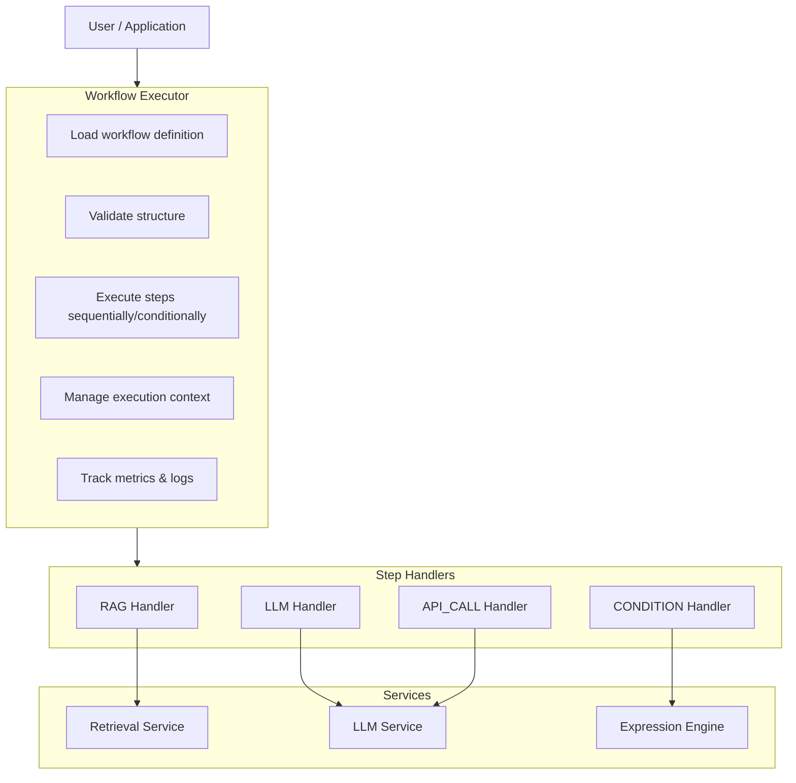

# Knowledge & Workflow Engine - Design Document

**Author**: Rajan Mishra  
**Date**: December 4, 2025

---

## Table of Contents

1. [Executive Summary](#executive-summary)
2. [System Overview](#system-overview)
3. [Core Abstractions](#core-abstractions)
4. [Architecture](#architecture)
5. [Execution Model](#execution-model)
6. [Extensibility & Versioning](#extensibility--versioning)
7. [Observability](#observability)
8. [Multi-Tenancy & Security](#multi-tenancy--security)
9. [Error Handling](#error-handling)
10. [Assumptions & Trade-offs](#assumptions--trade-offs)

---

## 1. What This System Does

The Knowledge & Workflow Engine combines:

- **Knowledge Management**: Multi-tenant document collections with semantic search (RAG)
- **Workflow Orchestration**: JSON-configured multi-step AI pipelines with conditional logic

### Design Principles

1. **Config vs Code**: Workflows are JSON, not code - easier to validate, version, and edit
2. **Extensibility**: Adding new step types doesn't require changes to the core engine
3. **Multi-Tenancy**: org/sub-org isolation at every layer prevents data leakage
4. **Observability**: Full execution tracking because debugging AI systems is hard
5. **Safety**: Validation, error handling, timeouts - assume things will fail

---

## 2. System Overview

### The Problem

Organizations want domain-specific AI assistants that:
- Pull information from private knowledge bases
- Use LLMs to reason over that information  
- Make decisions based on confidence thresholds
- Take actions (API calls, database updates, notifications)

Hard parts:
- Multi-tenancy (data isolation)
- Versioning (workflows change, old executions need to reference old definitions)
- Observability (AI systems are black boxes without good logging)
- Extensibility (new step types without rewriting core logic)

### Solution Architecture



### Data Flow

1. **Input**: User provides organization ID, input payload, workflow ID
2. **Validation**: Engine validates workflow structure
3. **Execution**:
   - Start at `entryStepId`
   - For each step:
     - Get handler from registry
     - Resolve template variables
     - Execute handler logic
     - Store output in context
     - Determine next step
   - Continue until no next step
4. **Output**: Return execution record with status, outputs, metrics, logs

---

## 3. Core Abstractions

### 3.1 Organization & SubOrganization

**Purpose**: Multi-tenant ownership hierarchy

```typescript
Organization {
  id: string
  name: string
  metadata: Record<string, unknown>
  settings: {
    maxCollections?: number
    maxWorkflows?: number
    allowSubOrganizations: boolean
  }
  status: 'active' | 'suspended' | 'archived'
  createdAt: Date
  updatedAt: Date
}

SubOrganization {
  id: string
  organizationId: string  // Parent org
  name: string
  inheritSettings: boolean
  status: 'active' | 'suspended' | 'archived'
  createdAt: Date
  updatedAt: Date
}
```

**Design Rationale**:
- Two-level hierarchy balances simplicity and flexibility
- Settings inheritance reduces configuration overhead
- Status field lets you soft-delete or suspend orgs

### 3.2 KnowledgeCollection

**Purpose**: Container for documents with shared configuration

```typescript
KnowledgeCollection {
  id: string
  organizationId: string
  subOrganizationId?: string
  name: string
  description?: string
  
  embeddingConfig: {
    model: string          // e.g., "text-embedding-ada-002"
    dimensions: number     // e.g., 1536
    chunkSize: number      // default: 512 tokens
    chunkOverlap: number   // default: 50 tokens
  }
  
  version: number
  status: 'active' | 'indexing' | 'archived'
  stats: {
    documentCount: number
    chunkCount: number
    totalSize: number
  }
  
  createdAt: Date
  updatedAt: Date
}
```

**Design Rationale**:
- Embedding config at collection level ensures consistency
- Stats are denormalized for performance
- Version field lets you migrate schemas

### 3.3 Document & DocumentChunk

**Purpose**: Atomic units of knowledge

```typescript
Document {
  id: string
  collectionId: string
  organizationId: string
  subOrganizationId?: string
  
  name: string
  contentType: string      // MIME type
  content?: string         // Raw text
  
  source: {
    type: 'upload' | 'url' | 'api' | 'integration'
    url?: string
    uploadedBy?: string
  }
  
  processingStatus: 'pending' | 'processing' | 'completed' | 'failed'
  processingError?: string
  
  metadata: Record<string, unknown>
  stats: { size: number, chunkCount: number, tokenCount?: number }
  version: number
  createdAt: Date
  updatedAt: Date
}

DocumentChunk {
  id: string
  documentId: string
  collectionId: string
  organizationId: string
  subOrganizationId?: string
  
  text: string
  embedding: number[]      // Vector for similarity search
  
  position: {
    index: number          // 0-based chunk index
    startChar?: number     // Position in original document
    endChar?: number
  }
  
  metadata: Record<string, unknown>
  tokenCount?: number
  version: number
  createdAt: Date
}
```

**Design Rationale**:
- Chunks are first-class entities (not embedded in documents)
- Position tracking lets you reconstruct context
- Metadata propagates from document to chunks for filtering

### 3.4 Workflow & WorkflowStep

**Purpose**: Declarative workflow definition

```typescript
Workflow {
  id: string
  organizationId: string
  subOrganizationId?: string
  
  name: string
  description?: string
  
  version: number
  versionLabel?: string    // e.g., "v1.2.3"
  isLatest: boolean
  parentVersionId?: string // For version history
  
  entryStepId: string
  steps: WorkflowStep[]
  
  inputSchema?: Record<string, unknown>
  outputSchema?: Record<string, unknown>
  
  maxSteps: number         // Prevent infinite loops
  maxExecutionTimeMs?: number
  
  status: 'draft' | 'active' | 'deprecated' | 'archived'
  tags?: string[]
  metadata?: Record<string, unknown>
  
  stats?: {
    executionCount: number
    successRate?: number
    avgExecutionTimeMs?: number
  }
  
  createdAt: Date
  updatedAt: Date
  createdBy?: string
}

WorkflowStep {
  id: string              // Unique within workflow
  type: StepType          // RAG, LLM, CONDITION, etc.
  label: string
  description?: string
  
  params: Record<string, unknown>  // Type-specific
  
  // Flow control
  nextStepId?: string     // Linear flow
  onSuccess?: string      // Success handler
  onFailure?: string      // Error handler
  condition?: string      // Execute only if true
  
  // Execution config
  retry?: {
    maxAttempts: number
    backoffMs: number
  }
  timeoutMs?: number
  
  metadata?: Record<string, unknown>
}
```

**Design Rationale**:
- **Separation of definition and execution**: Workflows are immutable configs
- **Versioning**: Each version is a separate entity with history tracking
- **Flexible flow control**: Supports linear, conditional, and error-handling flows
- **Type-safe params**: Each step type validates its own params

### 3.5 WorkflowExecution

**Purpose**: Execution instance with full observability

```typescript
WorkflowExecution {
  id: string
  workflowId: string
  workflowVersion: number
  organizationId: string
  subOrganizationId?: string
  
  inputPayload: Record<string, unknown>
  outputPayload?: Record<string, unknown>
  
  status: 'pending' | 'running' | 'completed' | 'failed' | 'timeout' | 'cancelled'
  
  error?: {
    message: string
    code?: string
    stepId?: string
    stack?: string
  }
  
  startedAt?: Date
  completedAt?: Date
  durationMs?: number
  
  stepExecutions: Array<{
    stepId: string
    stepType: string
    status: 'pending' | 'running' | 'completed' | 'failed' | 'skipped'
    input?: Record<string, unknown>
    output?: Record<string, unknown>
    error?: string
    startedAt?: Date
    completedAt?: Date
    durationMs?: number
    retryCount: number
  }>
  
  metrics?: {
    stepsExecuted: number
    llmCallCount: number
    ragQueryCount: number
    totalTokensUsed: number
  }
  
  metadata?: Record<string, unknown>
  createdAt: Date
}
```

**Design Rationale**:
- **Complete audit trail**: Every step execution is recorded
- **Performance tracking**: Duration and resource usage at each level
- **Error context**: Capture exactly where and why failures occurred
- **Replay capability**: Full execution state for debugging and replay

---

## 4. Architecture

### 4.1 Workflow Engine Core

#### StepRegistry

```typescript
class StepRegistry {
  private handlers = new Map<StepType, BaseStepHandler>();
  
  register(type: StepType, handler: BaseStepHandler): void
  getHandler(type: StepType): BaseStepHandler
  hasHandler(type: StepType): boolean
}
```

**Purpose**: Central registry for step type handlers

**Extensibility**: Adding a new step type:
1. Implement `BaseStepHandler`
2. Call `registry.register(type, handler)`
3. Use in workflow JSON

#### BaseStepHandler

```typescript
abstract class BaseStepHandler {
  abstract readonly type: StepType
  abstract readonly description: string
  
  abstract validateParams(params: Record<string, unknown>): void
  abstract execute(params, context): Promise<StepResult>
  abstract getParamSchema(): Record<string, unknown>
}
```

**Purpose**: Interface contract for all step handlers

**Benefits**:
- Type-safe parameter validation
- Consistent error handling
- Schema-driven documentation

#### WorkflowExecutor

```typescript
class WorkflowExecutor {
  constructor(private registry: StepRegistry)
  
  async execute(
    workflow: Workflow,
    orgId: string,
    input: Record<string, unknown>,
    subOrgId?: string,
    options?: ExecutionOptions
  ): Promise<WorkflowExecution>
}
```

**Purpose**: Orchestrates workflow execution

**Responsibilities**:
1. Validate workflow structure
2. Initialize execution context
3. Execute steps sequentially/conditionally
4. Handle retries and timeouts
5. Aggregate metrics and logs

### 4.2 Template Engine

**Purpose**: Resolve `{{variable}}` placeholders in step parameters

**Supported Syntax**:
- `{{input.field}}` - Input payload
- `{{steps.stepId.output.field}}` - Previous step outputs
- `{{steps.stepId.output[0].field}}` - Array indexing
- `{{context.variable}}` - Execution context

**Implementation**: Safe path resolution without `eval()`

**Example**:
```json
{
  "params": {
    "prompt": "Answer this question: {{input.question}}\n\nContext: {{steps.retrieve.output.results[0].text}}"
  }
}
```

### 4.3 Expression Engine

**Purpose**: Evaluate boolean expressions for conditional branching

**Supported Operations**:
- Comparisons: `==`, `!=`, `>`, `<`, `>=`, `<=`
- String: `contains`, `startsWith`, `endsWith`
- Logical: `&&`, `||`, `!`
- Parentheses for grouping

**Security**: Custom parser (no `eval()` or `Function()`)

**Example**:
```
steps.retrieve.output.count > 0 && steps.retrieve.output.results[0].score >= 0.7
```

---

## 5. Execution Model

### 5.1 Execution Flow

```
┌─────────────────────────────────────────────────────────┐
│ 1. Load Workflow Definition                             │
│    - By workflow ID and version                          │
│    - Validate structure (validator)                      │
└───────────────────────┬─────────────────────────────────┘
                        │
                        ▼
┌─────────────────────────────────────────────────────────┐
│ 2. Initialize Execution Context                          │
│    - Create WorkflowExecution record                     │
│    - Set status = 'running'                              │
│    - Initialize template context                         │
│      context = {                                         │
│        input: inputPayload,                              │
│        steps: {},                                        │
│        context: { orgId, executionId, ... }              │
│      }                                                   │
└───────────────────────┬─────────────────────────────────┘
                        │
                        ▼
┌─────────────────────────────────────────────────────────┐
│ 3. Execute Steps                                         │
│    currentStepId = workflow.entryStepId                  │
│    while currentStepId != null:                          │
│      - Find step by ID                                   │
│      - Get handler from registry                         │
│      - Resolve template variables in params              │
│      - Execute handler                                   │
│      - Store output in context.steps[stepId]             │
│      - Update execution record                           │
│      - Determine next step:                              │
│        • Linear: step.nextStepId                         │
│        • Success: step.onSuccess                         │
│        • Failure: step.onFailure                         │
│        • Conditional: from CONDITION output              │
│      currentStepId = nextStep                            │
└───────────────────────┬─────────────────────────────────┘
                        │
                        ▼
┌─────────────────────────────────────────────────────────┐
│ 4. Finalize Execution                                    │
│    - Set status = 'completed' or 'failed'                │
│    - Calculate total duration                            │
│    - Aggregate metrics                                   │
│    - Return WorkflowExecution                            │
└─────────────────────────────────────────────────────────┘
```

### 5.2 Step Execution Lifecycle

```
┌─────────────┐
│   PENDING   │
└──────┬──────┘
       │
       ▼
┌─────────────┐
│   RUNNING   │ ──── Execution
└──────┬──────┘
       │
       ├───────────┐
       │           │
       ▼           ▼
┌─────────────┐ ┌─────────────┐
│  COMPLETED  │ │   FAILED    │
└─────────────┘ └──────┬──────┘
                       │
                       ├─ Retry? ─┐
                       │           │
                       ▼           ▼
                  onFailure?   Throw Error
                       │
                       ▼
                  Next Step
```

### 5.3 Context Management

**Execution Context Structure**:
```typescript
{
  input: {
    question: "What is your refund policy?"
  },
  steps: {
    s01_retrieve: {
      output: {
        results: [
          { text: "...", score: 0.89 },
          { text: "...", score: 0.76 }
        ],
        count: 2
      },
      metadata: {
        duration: 342,
        ragQueryCount: 1
      }
    },
    s02_generate: {
      output: {
        text: "Based on our policy...",
        usage: { totalTokens: 250 }
      },
      metadata: {
        duration: 1823,
        tokensUsed: 250,
        llmCallCount: 1
      }
    }
  },
  context: {
    workflowId: "wf_refund_v1",
    executionId: "exec_123",
    organizationId: "org_demo"
  }
}
```

**Context Update Flow**:
1. Step executes
2. Handler returns `StepResult`
3. Executor stores in `context.steps[stepId]`
4. Next step can access via templates: `{{steps.stepId.output.field}}`

---

## 6. Extensibility & Versioning

### 6.1 Adding New Step Types

**Step 1: Create Handler**

```typescript
export class WebhookStepHandler extends BaseStepHandler {
  readonly type = 'WEBHOOK';
  readonly description = 'Send HTTP webhook';

  validateParams(params: Record<string, unknown>): void {
    // Validate webhook params
  }

  async execute(params, context): Promise<StepResult> {
    // Send webhook
    const response = await fetch(params.url, {
      method: 'POST',
      body: JSON.stringify(params.payload)
    });
    
    return this.success({ status: response.status });
  }

  getParamSchema(): Record<string, unknown> {
    return {
      type: 'object',
      properties: {
        url: { type: 'string', format: 'uri' },
        payload: { type: 'object' }
      },
      required: ['url']
    };
  }
}
```

**Step 2: Register**

```typescript
import { globalStepRegistry } from './workflows/stepRegistry.ts';
import { WebhookStepHandler } from './workflows/handlers/webhookStepHandler.ts';

globalStepRegistry.register('WEBHOOK', new WebhookStepHandler());
```

**Step 3: Use**

```json
{
  "id": "send_notification",
  "type": "WEBHOOK",
  "label": "Notify Support Team",
  "params": {
    "url": "https://api.example.com/webhooks/support",
    "payload": {
      "event": "escalation",
      "details": "{{steps.analyze.output.summary}}"
    }
  }
}
```

### 6.2 Workflow Versioning

**Version Strategy**: Immutable versions with history tracking

**Creating a New Version**:

```typescript
import { createWorkflowVersion } from './models/workflow.ts';

const v2 = createWorkflowVersion(workflowV1, {
  steps: updatedSteps,
  description: 'Added fallback handling'
});

// v2.version = 2
// v2.parentVersionId = workflowV1.id
// v2.isLatest = true
// workflowV1.isLatest = false (updated separately)
```

**Version Selection**:
- Default: Use `isLatest = true`
- Explicit: Specify version number
- Rollback: Mark older version as latest

**Benefits**:
- Safe updates (no breaking existing executions)
- A/B testing (run multiple versions concurrently)
- Audit trail (track all changes)

---

## 7. Observability

### 7.1 Execution Tracking

**Levels of Observability**:

1. **Workflow Level**: Status, duration, overall metrics
2. **Step Level**: Individual step status, inputs, outputs, duration
3. **Log Level**: Detailed events and errors

**ExecutionLog Structure**:

```typescript
{
  id: string
  executionId: string
  workflowId: string
  level: 'debug' | 'info' | 'warn' | 'error'
  message: string
  stepId?: string
  data?: Record<string, unknown>
  timestamp: Date
}
```

### 7.2 Metrics Collection

**Aggregated at Execution Level**:
- `stepsExecuted`: Total steps run
- `llmCallCount`: Number of LLM API calls
- `ragQueryCount`: Number of RAG searches
- `totalTokensUsed`: Cumulative token usage

**Per-Step Metrics**:
- Duration in milliseconds
- Retry count
- Resource usage (tokens, API calls)

**Use Cases**:
- Cost analysis
- Performance optimization
- Failure diagnosis
- Usage analytics

### 7.3 Debugging Workflow

**Debug Flow**:

1. **Find Failed Execution**: Query by workflow ID, status = 'failed'
2. **Identify Failed Step**: Check `execution.stepExecutions`
3. **Inspect Inputs**: Review `stepExecution.input`
4. **Check Error**: Read `stepExecution.error`
5. **Review Context**: See what data was available from previous steps
6. **Replay**: Re-run with same inputs for debugging

---

## 8. Multi-Tenancy & Security

### 8.1 Tenant Isolation

**Hierarchy**:
```
Organization (org_demo)
  ├── SubOrganization (suborg_sales)
  │   ├── KnowledgeCollection (coll_sales_docs)
  │   └── Workflow (wf_sales_assistant)
  └── SubOrganization (suborg_support)
      ├── KnowledgeCollection (coll_support_docs)
      └── Workflow (wf_support_assistant)
```

**Enforcement**:
- Every entity has `organizationId` (and optionally `subOrganizationId`)
- All queries filter by organization
- Cross-tenant access is explicitly forbidden

**Example Query**:
```typescript
const chunks = await retrievalService.search({
  collectionId: 'coll_policies',
  query: 'refund policy',
  topK: 5,
  organizationId: execution.organizationId,  // ← Required
  subOrganizationId: execution.subOrganizationId
});
```

### 8.2 Authorization

**Assumptions** (not implemented in this version):
- API layer would authenticate users
- Users are assigned to organizations/sub-orgs
- Workflows can only access collections in same org/sub-org

**Future**: Implement permission model (RBAC):
```typescript
{
  userId: "user_123",
  organizationId: "org_demo",
  subOrganizationId: "suborg_sales",
  roles: ["admin", "workflow_editor"],
  permissions: [
    "workflows:execute",
    "workflows:edit",
    "collections:read"
  ]
}
```

---

## 9. Error Handling

### 9.1 Error Categories

**1. Validation Errors** (before execution):
- Invalid workflow structure
- Circular references
- Missing steps
- Invalid parameters

**2. Execution Errors** (during execution):
- Step handler failures (LLM timeout, RAG failure)
- Template resolution errors
- Expression evaluation errors
- Timeout errors

**3. Resource Errors**:
- Collection not found
- Document not found
- Model not available

### 9.2 Error Recovery Strategies

**Retry Logic**:
```json
{
  "retry": {
    "maxAttempts": 3,
    "backoffMs": 1000  // Exponential: 1s, 2s, 3s
  }
}
```

**Failure Handlers**:
```json
{
  "id": "risky_step",
  "type": "API_CALL",
  "onFailure": "fallback_step"  // Route to graceful fallback
}
```

**Graceful Degradation**:
```json
{
  "id": "check_quality",
  "type": "CONDITION",
  "params": {
    "expression": "steps.retrieve.output.count == 0",
    "ifTrue": "fallback_response",  // No data found
    "ifFalse": "continue_processing"
  }
}
```

### 9.3 Error Reporting

**Structured Error Objects**:
```typescript
{
  message: "LLM call failed: timeout after 10000ms",
  code: "LLM_TIMEOUT",
  stepId: "s02_generate",
  recoverable: true,  // Could retry succeed?
  stack: "..."  // For debugging
}
```

**Error Context**:
- Which step failed
- What were the inputs
- What was the error message
- Was it recoverable

---

## 10. Assumptions & Trade-offs

### 10.1 Assumptions

1. **Single-threaded execution**: Steps execute sequentially (no parallel)
   - Simplifies state management
   - Future: Add PARALLEL step type

2. **In-memory context**: All step outputs stored in memory
   - Fast access
   - Limit: Large outputs could cause issues
   - Future: Overflow to storage for large contexts

3. **Synchronous workflow execution**: Caller waits for completion
   - Simple programming model
   - Future: Add async execution with callbacks

4. **Mock services**: LLM and retrieval are stubs
   - Lets you develop without external dependencies
   - Production: Swap with real implementations

5. **No authentication**: Focus on engine logic
   - Production: Add JWT/OAuth layer

### 10.2 Trade-offs

**Flexibility vs. Complexity**:
- **Choice**: JSON-based DSL for workflows
- **Pro**: Non-developers can edit, version control friendly
- **Con**: Limited compared to code (no loops, complex logic)
- **Mitigation**: Add more step types as needed

**Performance vs. Observability**:
- **Choice**: Log every step execution
- **Pro**: Complete debugging trail
- **Con**: Storage overhead for high-volume systems
- **Mitigation**: Configurable log levels, log retention policies

**Safety vs. Expressiveness**:
- **Choice**: No `eval()` in template/expression engines
- **Pro**: Prevents code injection
- **Con**: Limited expression capabilities
- **Mitigation**: Extend parser for new operations

**Consistency vs. Latency**:
- **Choice**: Synchronous step execution
- **Pro**: Simple error handling, guaranteed order
- **Con**: Long-running workflows block
- **Mitigation**: Timeout protection, async mode future enhancement

### 10.3 Future Enhancements

**Near-term**:
1. **REST API layer**: Enable HTTP access
2. **Real database**: PostgreSQL + pgvector
3. **Real LLM providers**: OpenAI, Anthropic integrations
4. **Webhook step**: HTTP callbacks
5. **Loop step**: Iterate over arrays

**Mid-term**:
1. **Parallel execution**: Execute multiple steps concurrently
2. **Workflow builder UI**: Visual editor
3. **Dashboard**: Real-time monitoring
4. **Caching**: Cache LLM responses, embeddings
5. **Rate limiting**: Protect external APIs

**Long-term**:
1. **Workflow marketplace**: Share workflows across orgs
2. **Auto-optimization**: ML-driven workflow optimization
3. **Multi-modal**: Support images, audio
4. **Distributed execution**: Horizontal scaling

---

## Final Thoughts

This design works for building AI assistants:

- Clean abstractions that map to real concepts
- Easy to extend with new step types
- Production concerns handled (errors, logging, multi-tenancy)
- Full execution tracking for debugging
- Safe (validation, timeouts, tenant isolation)

Built to evolve: start simple, grow to complex multi-step reasoning, scale to thousands of orgs.

---

**Author**: Rajan Mishra  
**Last Updated**: December 5, 2025  
**Next Review**: When adding first production integration
